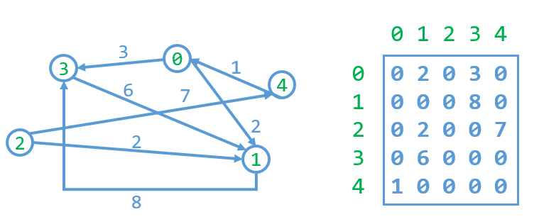
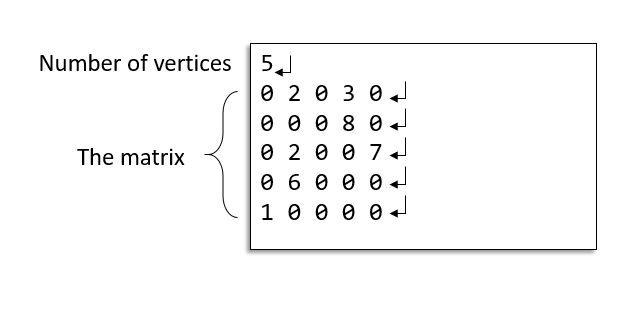
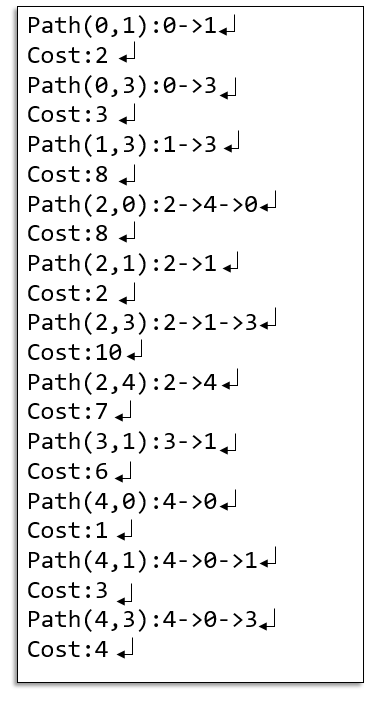

# [All Pair Shortest Paths](https://acm.cs.nthu.edu.tw/problem/11923/)
## Description
- Convert the nonzero digits of the matrix into a graph
- Print out the shortest path of each pair of nodes and cost.
- Each cell in the matrix contains a digit value (ranged from 0 to 9)
    - 0 represents no edge between two nodes
- Nonzero digits represents the weights of two node    



## Input
- Given the number of vertices.
    - 2 ≦ Number of vertices ≦ 100
- A matrix contains a digit value (ranged from 0 to 9)
    - 0 represents no edge between two nodes    



## Output
- Print out the shortest path with row major order and the corresponding cost for each pair.
    - Path(from,to):from->...->...->to
    - Cost:xxx
- If the cost of the multiple paths are equivalent, select the one which the string of path is smaller (string comparison). 
    - EX: (three paths with the same cost)
        - path A: 1->2->3->4->5
        - path B: 1->3->2->4->5
        - path C: 1->4->5
    - You need to print path A.     
    


### [Sample Input](sampleIn.txt)
```
5 
0 4 0 9 0 
8 0 1 5 0 
4 2 0 0 9 
1 0 0 0 0 
7 8 7 5 0 
```

### [Sample Output](sampleOut.txt)
```
Path(0,1):0->1
Cost:4
Path(0,2):0->1->2
Cost:5
Path(0,3):0->1->3
Cost:9
Path(0,4):0->1->2->4
Cost:14
Path(1,0):1->2->0
Cost:5
Path(1,2):1->2
Cost:1
Path(1,3):1->3
Cost:5
Path(1,4):1->2->4
Cost:10
Path(2,0):2->0
Cost:4
Path(2,1):2->1
Cost:2
Path(2,3):2->1->3
Cost:7
Path(2,4):2->4
Cost:9
Path(3,0):3->0
Cost:1
Path(3,1):3->0->1
Cost:5
Path(3,2):3->0->1->2
Cost:6
Path(3,4):3->0->1->2->4
Cost:15
Path(4,0):4->3->0
Cost:6
Path(4,1):4->1
Cost:8
Path(4,2):4->2
Cost:7
Path(4,3):4->3
Cost:5
```